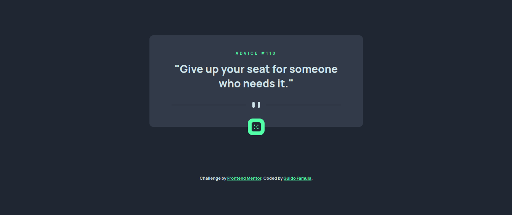
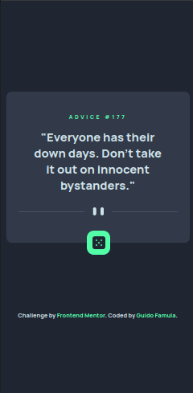

<h1 align="center">Advice Generator App</h1>

</img>

   Challenge by  <a href="https://www.frontendmentor.io?ref=challenge" target="_blank">frontendmentor.io</a>. Coded by <a href="https://guidofamula.com">Guido Famula</a>.

  <h3>
    <a href="https://www.frontendmentor.io/solutions/advice-generator-app-xllNa9DF5C" target='_blank' color="white">
      Solution URL
    </a>
   ~||~     <a target='_blank' href="https://advice-generator-api-six.vercel.app/">
      Live URL
    </a>
   ~||~     <a target='_blank' href="https://www.frontendmentor.io/challenges/advice-generator-app-QdUG-13db">
      Challenge URL
    </a>
  </h3>

 
 

## Table of contents

- [Overview](#overview)
  - [The challenge](#the-challenge)
  - [Mobile Version](#mobile-version)
- [My process](#my-process)
  - [Built with](#built-with)
  - [Useful resources](#useful-resources)
- [Author](#author)
- [Acknowledgments](#acknowledgments)

## Overview

### The challenge

Users should be able to:

- View the optimal layout for the app depending on their device's screen size
- See hover states for all interactive elements on the page
- Generate a new piece of advice by clicking the dice icon

### Mobile Version

<h2 align='center'>Mobile version</h2>

</img>

 

## My process

### Built with

- Semantic HTML5 markup
- CSS custom properties
- CSS Grid
- Mobile-first workflow
- Vanilla JS
- [Vite](https://vitejs.dev/) - Module Bundler
- [SASS](https://tailwindcss.com/) - For styles CSS Preprocessing

### What I learned

- [GeeksForGeeks](https://www.geeksforgeeks.org/how-to-use-the-javascript-fetch-api-to-get-data/) - This is an amazing reference which helped me guiding for fetching API with async-await. I'd recommend it to anyone still learning fetch external api.

## Author

- My Website - [GUIDOFAMULA.COM](https://guidofamula.com)
- Frontend Mentor - [@guidofamula](https://www.frontendmentor.io/profile/guidofamula)
- Linkedin - [Guido Famula](https://www.linkedin.com/in/guido-famula/)

## Acknowledgments

Thank you to all my friends or frontend mentor friends who often give me advice and guidance, so that I am more motivated and focused on living my activities as a frontend developer.
